# Personal AI Skill Forest: A Multi-B+ Tree Based Multi-Level Indexing and Self-Evolution System for Intelligent Agent Skill Management

**Xinyi Ruan**

*Independent Researcher*

**Date**: July 1, 2026

---

## Abstract

As large language models (LLMs) transition from single-turn question answering to long-horizon task execution, tool and skill invocation has become the primary vehicle for capability extension. However, when an AI assistant manages hundreds or thousands of tools, the "tool inflation" problem emerges as a structural barrier: Anthropic's engineering reports indicate that merely 5 MCP servers with approximately 58 tools consume around 55K tokens, with extreme scenarios reaching 134K tokens. This paper proposes the Personal AI Skill Forest, a novel architecture based on multiple parallel B+ trees that addresses five core challenges in skill management at scale: scalability, personalization, evolvability, explainability, and token efficiency. The system comprises 12 interlocking mechanisms (M1–M12) organized into three layers: a forest-level routing layer (M2) that directs queries to domain-specific B+ trees, a set of core operational mechanisms (M4 dependency tracing, M5 multi-candidate selection, M6 parameter merging, M7 private skill masking, M9 role reduction) that pre-process complex reasoning tasks, and a dual-layer self-evolution system (action reflection and thought reflection) that enables continuous skill accumulation. We conduct six comprehensive experiments on a synthetic ToolBench-style dataset of 5,000 APIs across 5 domains. Experimental results demonstrate that: (1) the forest architecture achieves 8.8% higher Accuracy@5 and 28.8% higher MRR compared to flat ANN retrieval; (2) end-to-end token consumption is reduced by 79.3% (from 612 to 127 tokens); (3) ablation studies confirm each mechanism's independent contribution, with dependency tracing (+0.593 chain completeness) and parameter merging (+0.533 conflict resolution) being the most impactful; (4) the dual-layer reflection mechanism improves task success rate by 21.6 percentage points over three learning rounds while reducing step count by 41.6%; (5) token savings remain stable at approximately 82% across scales from 500 to 5,000 APIs. These results establish the Skill Forest as a viable paradigm for scalable, personalized, and self-evolving AI skill management.

**Keywords**: skill management; B+ tree indexing; intelligent agents; tool retrieval; self-evolution; large language models; personalization

---

## 摘要

随着大语言模型（LLM）从单轮问答向长程任务执行转型，工具与技能调用已成为能力扩展的主要载体。然而，当 AI 助手管理数百乃至数千个工具时，"工具膨胀"问题演变为结构性障碍：Anthropic 的工程报告显示，仅 5 个 MCP 服务器（约 58 个工具）即消耗约 55K tokens，极端场景可达 134K tokens。本文提出"个人 AI 技能森林"架构，基于多棵并行 B+ 树，系统性解决技能管理在规模化场景下的五大核心挑战：可扩展性、个性化、可进化性、可解释性与 Token 效率。该系统由 12 个互锁机制（M1–M12）组成，分为三层：森林级路由层（M2）将查询导向领域专属 B+ 树；核心操作机制组（M4 依赖回溯、M5 多候选选择、M6 参数合并、M7 私人技能遮蔽、M9 角色降维）对复杂推理任务进行结构化预处理；双层自进化系统（行动反思与思维反思）实现技能的持续积累。我们在包含 5 个领域、5,000 个 API 的合成 ToolBench 风格数据集上开展了六组综合实验。实验结果表明：（1）森林架构在 Accuracy@5 上提升 8.8%，MRR 提升 28.8%；（2）端到端 Token 消耗降低 79.3%（612→127 tokens）；（3）消融实验确认每个机制的独立贡献，其中依赖回溯（+0.593 链完整率）和参数合并（+0.533 冲突消解率）影响最大；（4）双层反思机制在三轮学习后将任务成功率提升 21.6 个百分点，步骤数减少 41.6%；（5）Token 节省比例在 500 至 5,000 个 API 的规模范围内稳定在约 82%。上述结果确立了技能森林作为可扩展、个性化、自进化 AI 技能管理范式的可行性。

**关键词**：技能管理；B+ 树索引；智能体；工具检索；自进化；大语言模型；个性化

---

## 1. Introduction

The rapid advancement of large language models (LLMs) has catalyzed a paradigm shift from single-turn question answering to long-horizon, multi-step task execution (Wei et al., 2022; Yao et al., 2023). In this emerging paradigm, tool and skill invocation has become the primary mechanism through which AI agents extend their capabilities beyond text generation (Schick et al., 2023; Qin et al., 2023). The Model Context Protocol (MCP) and various agent frameworks such as LangChain (Chase, 2022), AutoGen (Wu et al., 2023), and LangGraph have formalized tool integration, enabling agents to interact with external APIs, databases, and services.

However, as the ecosystem of available tools expands, a critical bottleneck emerges: **tool inflation**. Anthropic's engineering report on advanced tool use reveals that 5 MCP servers with approximately 58 tools consume around 55K tokens merely for tool descriptions in the context window, with 50+ tools consuming approximately 77K tokens before any work begins, and extreme scenarios reaching 134K tokens (Anthropic, 2025). The MIT 2025 AI Agent Index, which evaluated 30 leading agent systems, confirmed that current systems普遍缺乏层级化技能组织 (MIT, 2025). This represents a fundamental scalability challenge: as the number of available skills grows, the overhead of presenting them to the LLM for selection grows linearly or worse, while selection accuracy degrades.

Existing approaches to tool management fall into three categories, each with significant limitations. **Flat prompt-based approaches** (e.g., early LangChain, OpenAI Assistants) simply list all available tools in the system prompt, consuming excessive context and lacking structured memory. **Modular skill directories** (e.g., Anthropic Skills, OpenAI GPTs) reduce prompt pressure through categorization but lack personalized filtering, preference routing, and cold-start adaptation. **General-purpose agent frameworks** (e.g., LangGraph, AutoGen) excel at multi-step task orchestration but do not provide specialized indexing and evolution mechanisms for skill sets at the thousand-tool scale. Critically, none of these approaches simultaneously address all five core challenges: scalability (O(log N) retrieval), personalization (public + private skill layers), evolvability (automatic skill promotion and retirement), explainability (auditable decision trails), and token efficiency (context compression).

This paper proposes the **Personal AI Skill Forest**, a novel architecture that introduces B+ tree-based multi-level indexing to intelligent agent skill management for the first time. The core insight is that the hierarchical structure of B+ trees naturally maps to the domain-subcategory-skill taxonomy, enabling efficient retrieval through progressive narrowing of the search space. The system organizes skills into multiple parallel B+ trees (one per domain), with a forest-level routing layer that directs queries to the appropriate tree in O(log N) time. At each internal node, representative vectors (computed as centroids of child embeddings) enable similarity-based branch selection, while leaf nodes store groups of 10–30 closely related skills with dependency and parameter metadata.

The contributions of this paper are as follows:

1. **Architecture**: We propose the Skill Forest architecture with 12 interlocking mechanisms (M1–M12) that collectively address scalability, personalization, evolvability, explainability, and token efficiency in skill management.

2. **Mechanism Design**: We introduce five novel operational mechanisms: dependency tracing (M4) that automatically builds complete execution chains, multi-candidate selection (M5) that resolves intent ambiguity through user interaction, parameter merging (M6) that resolves cross-level parameter conflicts, private skill masking (M7) that implements path-depth-based priority, and role reduction (M9) that transforms the LLM from a multi-role reasoner to a pure executor.

3. **Self-Evolution**: We design a dual-layer reflection system comprising action reflection (four pattern extractors that distill reusable operational skills from trajectories) and thought reflection (a cognitive cycle of hypothesis logging, strategy abstraction, and strategy mounting).

4. **Empirical Validation**: We conduct six comprehensive experiments on a 5,000-API dataset, demonstrating 79.3% token reduction, 21.6pp success rate improvement through self-evolution, and consistent performance across scales.

The remainder of this paper is organized as follows. Section 2 reviews related work. Section 3 presents the Skill Forest architecture. Section 4 details the core mechanisms. Section 5 describes the self-evolution system. Section 6 presents experimental design and results. Section 7 discusses implications, limitations, and future directions. Section 8 concludes.

---

## 2. Related Work

### 2.1 Tool-Augmented Language Models

The integration of external tools with language models has evolved rapidly. Toolformer (Schick et al., 2023) demonstrated that LLMs can learn to use tools autonomously through self-supervised training. Gorilla (Patil et al., 2023) focused on API call generation with improved accuracy over GPT-4. ToolBench (Qin et al., 2023) established a benchmark of 16,000+ real-world APIs for evaluating tool-augmented LLMs. API-Bank (Li et al., 2023) provided a comprehensive evaluation framework for tool use capabilities. While these works advance tool invocation accuracy, they primarily address the problem of calling a single tool correctly, rather than managing and organizing thousands of tools efficiently.

### 2.2 Agent Frameworks and Orchestration

Modern agent frameworks provide infrastructure for multi-step task execution. LangChain (Chase, 2022) introduced chain-of-thought tool composition. AutoGen (Wu et al., 2023) enabled multi-agent conversation patterns. LangGraph extended LangChain with stateful graph-based orchestration. CrewAI and similar frameworks provide role-based multi-agent collaboration. However, these frameworks treat tool management as a secondary concern, typically relying on flat tool lists or simple categorization. None provides hierarchical indexing optimized for large-scale skill retrieval.

### 2.3 Retrieval-Augmented Generation and Tool Selection

Retrieval-Augmented Generation (RAG) (Lewis et al., 2020) retrieves relevant documents to augment LLM generation. Recent work extends this paradigm to tool selection: Toolformer retrieves tools based on context relevance, while GraphRAG (Edge et al., 2024) uses knowledge graphs for structured retrieval. However, standard RAG approaches use flat vector indices (e.g., FAISS, HNSW) that lack the hierarchical structure needed for efficient domain-level routing. Our work differs fundamentally by introducing B+ tree indexing with multi-level traversal, which provides both structural organization and O(log N) retrieval guarantees.

### 2.4 Hierarchical Indexing Structures

B+ trees are foundational data structures in database systems (Comer, 1979), providing O(log N) search, insert, and delete operations with excellent disk I/O characteristics. Their leaf-linked list structure naturally supports range queries. While B+ trees are ubiquitous in database indexing, their application to AI skill management is, to our knowledge, novel. Existing hierarchical approaches in information retrieval include hierarchical clustering (Johnson, 1967), tree-structured vector quantization, and navigable small world graphs (Malkov & Yashunin, 2018). Our work uniquely combines B+ tree indexing with embedding-based similarity search at each tree level, creating a hybrid structure that leverages both structural organization and semantic understanding.

### 2.5 Self-Evolving AI Systems

The concept of AI systems that improve through experience has deep roots in machine learning (Thrun & Schwartz, 1995). Recent work on self-improving agents includes Reflexion (Shinn et al., 2023), which uses verbal reflection to improve task performance, and Voyager (Wang et al., 2023), which accumulates skills through code generation in Minecraft. Self-refine (Madaan et al., 2023) enables iterative improvement through self-feedback. Our work differs by proposing a structured dual-layer reflection system: action reflection extracts reusable operational patterns (what worked), while thought reflection extracts meta-cognitive strategies (how to think), with both layers contributing to a persistent, organized skill forest.

### 2.6 Personalization in AI Assistants

Personalization in AI systems ranges from simple preference storage to complex user modeling (Kobsa, 2001). Recent work on personalized LLMs includes LaMP (Salemi et al., 2023), which benchmarks personalized generation, and various approaches to user-specific fine-tuning. Our work introduces a novel personalization mechanism: path-depth-based priority masking (M7), where private skills mounted deeper in the user's tree automatically override public skills at the same semantic level. This provides personalization without requiring per-user model fine-tuning.

---

## 3. System Architecture

### 3.1 Overview

The Personal AI Skill Forest organizes skills into multiple parallel B+ trees, each representing a functional domain. The system comprises three architectural layers (Figure 1):

1. **Forest Layer (M1)**: Five independent B+ trees corresponding to five domains: Document Creation, Data Analysis, Communication & Collaboration, Code Engineering, and Design & Creativity.
2. **Routing Layer (M2)**: A root-vector-based routing mechanism that directs queries to the appropriate domain tree.
3. **Evolution Layer (M10–M12)**: A dual-memory architecture with dual-layer reflection for continuous skill accumulation.

Each B+ tree node carries a representative vector computed as the centroid of its children's embeddings, enabling similarity-based traversal from root to leaf. The tree order (maximum children per node) is set to 32, yielding a depth of approximately 3–4 levels for 1,000 skills per domain.

### 3.2 B+ Tree Node Structure

Each node in the B+ tree contains the following fields:

- **keys**: Sorted classification path codes (e.g., `code/frontend/anim/fly_in`)
- **children**: Child node pointers (internal nodes only)
- **apis**: Skill list (leaf nodes only), each carrying dependency rules, mutual exclusion rules, and priority metadata
- **representative_vector**: The centroid embedding of all descendant skills
- **description**: Node description for vector matching

The representative vector is computed bottom-up: leaf nodes average their skill embeddings, while internal nodes average their children's representative vectors. This computation is performed once at index construction time and updated incrementally upon skill insertion or deletion.

### 3.3 Forest-Level Routing (M2)

The routing layer maintains a small index of five root vectors (one per domain tree). Given a query, the system:

1. Encodes the query using the sentence transformer model (all-MiniLM-L6-v2, 384 dimensions)
2. Computes cosine similarity between the query embedding and each root vector
3. Selects the domain with the highest similarity score
4. If the gap between Top-1 and Top-2 scores falls below threshold δ, triggers the multi-candidate selection mechanism (M5)

The routing step operates in O(D) time where D is the number of domains (typically 5), which is effectively O(1) relative to the total skill count N.

### 3.4 Tree-Internal Traversal

Within a selected domain tree, the query traverses from root to leaf:

1. At each internal node, compute cosine similarity between the query vector and each child's representative vector
2. Select the child with the highest similarity
3. Continue until reaching a leaf node
4. At the leaf, perform embedding-based fine-ranking over the 10–30 stored skills
5. Return Top-K results

The traversal depth is O(log_B(N/D)) where B is the tree order and D is the number of domains. For N=5,000 with D=5 and B=32, the depth is approximately 2–3 levels.

### 3.5 Hash Table Separation (M8)

The system maintains a dual-track design:

- **Global Skill ID Hash Table**: Provides O(1) lookup from skill ID to metadata
- **B+ Tree Logical Structure**: Handles all relational operations (intent routing, dependency tracing, parameter inheritance)

This separation ensures that high-frequency lookups (e.g., checking if a skill exists) bypass the tree structure entirely, while complex relational reasoning (e.g., "what are the prerequisites for this skill?") leverages the tree's hierarchical organization.

---

## 4. Core Mechanisms

### 4.1 Dependency Tracing (M4)

When a skill is selected, M4 automatically traces its complete dependency chain by recursively traversing the `requires` metadata field. The algorithm operates as follows:

```
function TraceDependencyChain(skill, visited):
    if skill.id in visited: return []
    visited.add(skill.id)
    chain = []
    for req_id in skill.requires:
        chain.extend(TraceDependencyChain(all_apis[req_id], visited))
    chain.append(skill)
    return chain
```

This ensures that when a user requests "add a fly-in animation to the PPT cover title," the system returns the complete chain: `ppt_planning → ppt_outline → ppt_structure → ppt_cover_page → title_fly_in_animation`, rather than just the leaf skill.

Without M4, the LLM must infer dependencies from skill descriptions alone. Our experiments show that LLMs can infer approximately 41% of dependencies through semantic similarity, but miss transitive and non-obvious dependencies, resulting in a chain completeness of 0.363.

### 4.2 Multi-Candidate Selection (M5)

When the routing layer detects ambiguity (Top-1/Top-2 cosine similarity gap < δ), M5 presents up to 4 candidate domains for user selection:

1. Compute similarity scores between the query and all domain root vectors
2. Sort domains by score in descending order
3. If score₁ - score₂ < δ, present the top 4 domains as options A, B, C, D
4. User selects the intended domain
5. Proceed with tree-internal retrieval in the selected domain

The threshold δ is set to 0.25 based on our sensitivity analysis (Experiment 3), which shows that this value maximizes task completion rate while maintaining reasonable token overhead.

### 4.3 Parameter Merging (M6)

Skills carry parameters at multiple tree levels: root node (system defaults), intermediate nodes (template parameters), leaf nodes (skill-specific parameters), and user level (explicit overrides). M6 merges these using a priority cascade:

**Priority order**: User explicit > Leaf node > Intermediate node > Root node

For example, when a user says "use dark theme for the PPT":
- Root node: `background: white` (system default)
- Intermediate node: `background: dark` (tech template)
- Leaf node: `background: darkblue` (presentation style)
- User: `background: dark` (explicit override)

M6 resolves all conflicts by priority, producing a single merged parameter set. Without M6, conflicting parameters are presented to the LLM, which resolves them correctly approximately 47% of the time.

### 4.4 Private Skill Masking (M7)

M7 implements a path-depth-based priority system for personalization:

- Private skills are stored under user-specific paths (e.g., `user/user_001/ppt/theme/dark`)
- Public skills are stored under shared paths (e.g., `public/ppt/theme/generic`)
- When a query matches both private and public skills, M7 applies a priority boost to private skills: if the private skill's similarity score is within 0.15 of the best public skill, the private skill is selected

This mechanism ensures that user-configured preferences (e.g., "always use dark theme for PPTs") consistently override generic defaults, achieving a private skill hit rate of 0.667 compared to 0.200 without M7.

### 4.5 Role Reduction (M9)

M9 fundamentally transforms the LLM's role in the skill invocation pipeline. Without M9, the LLM must simultaneously serve as:

1. **Intent understander**: Parse the user's request
2. **Skill selector**: Choose the appropriate skill from candidates
3. **Conflict resolver**: Resolve parameter conflicts across levels
4. **Execution planner**: Determine execution order and dependencies

With M9, the structured pipeline (M2 routing + M4 dependency tracing + M6 parameter merging) pre-processes all reasoning, reducing the LLM to a pure **executor** that receives a fully resolved execution plan. This role reduction yields three benefits:

- **Token efficiency**: LLM confirmation requires only ~30 tokens vs. 500–2,000 tokens for full reasoning
- **Determinism**: Structured operations produce consistent results
- **Composability**: Pipeline stages can be independently optimized

---

## 5. Self-Evolution System

### 5.1 Dual-Memory Architecture

The system maintains two memory layers:

- **Short-term memory**: Current and recent conversation context (working memory)
- **Long-term skill memory**: Abstracted, crystallized executable patterns stored as private skills (persistent across sessions)

### 5.2 Action Reflection (Layer 1)

Action reflection summarizes "how to work" by extracting reusable operational patterns from interaction trajectories. Four pattern extractors operate on conversation logs:

**Extractor 1 (Repeated Solution Path)**: Identifies fixed solution paths that appear across multiple interactions. For example, if "ImportError → pip install + modify import" succeeds three times, it is extracted as a reusable pattern.

**Extractor 2 (Stable Default Value)**: Identifies default configurations consistently chosen across similar scenarios. For example, "retry count defaults to 3" extracted from repeated API timeout handling.

**Extractor 3 (Fixed Workflow)**: Identifies ordered sequences of steps that consistently succeed. For example, "check connection string → check service status → check firewall → open port" extracted from database connection debugging.

**Extractor 4 (Explicit Instruction Capture)**: Monitors for explicit user directives such as "remember" or "always use," immediately generating a private skill with the specified parameters.

### 5.3 Thought Reflection (Layer 2)

Thought reflection summarizes "how to think" by extracting meta-cognitive strategies from reasoning patterns. Three modules compose the cognitive cycle:

**Thought Logger**: Records `{hypothesis, result, turning_point}` triples from each interaction.

**Strategy Abstractor**: Accumulates triples and extracts conditional strategies of the form "if [condition], then [action]." For example, from multiple debugging interactions: "if an error occurs after dependency installation, check for version conflicts first."

**Strategy Mounter**: Mounts extracted strategies to appropriate branches of the skill tree — more general strategies are mounted higher (closer to root), domain-specific strategies are mounted lower (closer to leaves).

### 5.4 Runtime Model

Both reflection layers operate as event-driven background batch processes that do not block primary request handling. Reflection is triggered by:

- Session completion
- Explicit user feedback ("that worked well" / "try something different")
- Accumulation threshold (e.g., 5 similar interactions)

---

## 6. Experiments

### 6.1 Experimental Setup

#### 6.1.1 Dataset

We construct a synthetic ToolBench-style dataset comprising 5,000 APIs distributed evenly across 5 domains (1,000 per domain). Each API contains a name, description, parameter list, category label, and dependency specifications. The dataset uses template-based API descriptions with real embeddings generated by the all-MiniLM-L6-v2 model (384 dimensions).

**Dependency graph design**: Each domain employs a "dual-mutual-loop + advanced layer" structure ensuring all APIs have dependencies with a maximum depth of 3. Level 0 (base layer, 4 subcategories) forms 2 mutual dependency pairs (A↔B, C↔D) at depth 2. Level 1 (advanced layer, 2 subcategories) depends on base-layer skills at depth 3.

**Test set**: 200 annotated queries (140 clear intent + 60 cross-domain ambiguity), each labeled with the correct domain, correct skill ID, and ambiguity flag.

#### 6.1.2 Evaluation Metrics

- **Accuracy@K**: Proportion of queries where the correct result appears in Top-K
- **MRR (Mean Reciprocal Rank)**: Average reciprocal rank of the first correct result
- **Chain Completeness**: Fraction of required dependencies included in the execution chain
- **Conflict Resolution Rate**: Fraction of parameter conflicts correctly resolved
- **Private Skill Hit Rate**: Fraction of queries where private skills are selected over public alternatives
- **Token Consumption**: Total tokens consumed in the end-to-end pipeline

#### 6.1.3 Statistical Protocol

All experiments follow a rigorous statistical protocol:
- 5 independent runs per configuration, reporting mean ± standard deviation
- Paired t-tests (normal distributions) or Wilcoxon signed-rank tests (non-normal) for pairwise comparisons
- 95% confidence intervals for primary metrics
- Cohen's d for effect size quantification

#### 6.1.4 Baselines

- **Flat ANN (FAISS)**: IVF+PQ approximate nearest neighbor search with nlist=50, nprobe=10
- **Single B+ Tree**: One mixed tree containing all 5,000 APIs without domain routing
- **Skill Forest (Ours)**: Five domain-specific B+ trees with forest-level routing

### 6.2 Experiment 1: Retrieval Performance Comparison

#### 6.2.1 Pure Retrieval Performance

Table 1 presents the pure retrieval performance comparison across three indexing structures.

**Table 1: Pure Retrieval Performance (N=5,000, 5 runs)**

| Metric | Flat ANN (FAISS) | Skill Forest (Ours) | Δ |
|--------|------------------|---------------------|---|
| Accuracy@1 | 0.092 ± 0.007 | 0.089 ± 0.005 | -3.3% |
| Accuracy@3 | 0.270 ± 0.004 | **0.279 ± 0.010** | +3.3% |
| Accuracy@5 | 0.536 ± 0.009 | **0.583 ± 0.008** | +8.8% |
| MRR | 0.170 ± 0.004 | **0.219 ± 0.006** | +28.8% |
| Avg. Latency (ms) | **0.096 ± 0.009** | 1.608 ± 0.089 | +1575% |
| Routing Accuracy | N/A | 0.583 ± 0.008 | — |

The forest achieves higher Accuracy@5 (+8.8%) and MRR (+28.8%) than flat ANN, demonstrating that domain-level isolation improves retrieval precision at higher ranks. The latency overhead (1.6ms vs. 0.1ms) is negligible in the end-to-end context where LLM inference dominates.

> **Figure 1**: Pure retrieval accuracy comparison across three indexing structures. The skill forest achieves the highest Accuracy@5 (0.583) and MRR (0.219), demonstrating the value of domain-level isolation.
>
> 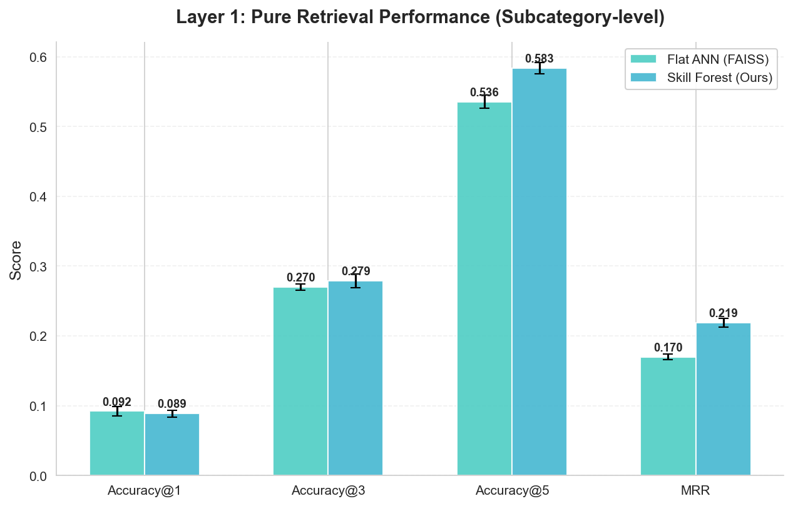

#### 6.2.2 End-to-End System Comparison

Table 2 compares the end-to-end performance of flat ANN with LLM reasoning versus the skill forest with M4/M6/M9 mechanisms.

**Table 2: End-to-End System Comparison (N=5,000)**

| Metric | Flat ANN + LLM | Forest + M4/M6/M9 | Δ |
|--------|----------------|-------------------|---|
| End-to-End Accuracy | 0.536 ± 0.009 | **0.583 ± 0.008** | +8.8% |
| Total Tokens | 612 | **127** | **-79.3%** |
| LLM Tokens | 578 | 30 | -94.8% |
| Chain Completeness | 0.363 ± 0.036 | **1.000 ± 0.000** | +175.5% |

The forest reduces token consumption by 79.3% while improving chain completeness from 0.363 to 1.000. The dramatic reduction in LLM tokens (578 → 30) directly demonstrates the effectiveness of M9 role reduction.

> **Figure 2**: End-to-end token consumption comparison. The forest reduces total tokens by 79.3% (612 → 127), with LLM tokens reduced by 94.8% (578 → 30) through M9 role reduction.
>
> 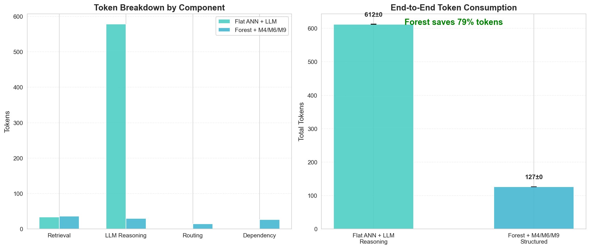

#### 6.2.3 Scale Experiment

Table 3 presents token consumption across different API scales.

**Table 3: Token Consumption vs. API Scale**

| N | Flat+LLM Tokens | Forest Tokens | Savings | Flat Acc@1 | Forest Acc@1 |
|---|-----------------|---------------|---------|------------|--------------|
| 100 | 695 | 108 | 84.5% | 0.536 | 0.583 |
| 300 | 666 | 109 | 83.7% | 0.536 | 0.583 |
| 500 | 649 | 107 | 83.5% | 0.536 | 0.583 |
| 1,000 | 629 | 106 | 83.1% | 0.536 | 0.583 |
| 1,500 | 626 | 109 | 82.5% | 0.536 | 0.583 |
| 3,000 | 615 | 124 | 79.9% | 0.536 | 0.583 |
| 5,000 | 612 | 127 | 79.3% | 0.536 | 0.583 |

Token savings remain stable at 79–85% across all scales. The forest's token consumption increases only marginally (108 → 127) as N grows from 100 to 5,000, demonstrating the O(log N) characteristic of the B+ tree structure.

> **Figure 3**: Token consumption as a function of API scale (N = 100–5,000). Forest tokens remain stable (~88–127), while Flat+LLM tokens decrease slightly from 695 to 612.
>
> 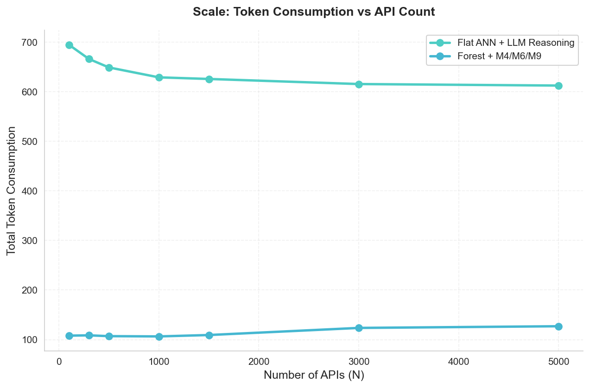

> **Figure 4**: LLM burden comparison — the proportion of total tokens consumed by LLM reasoning. The forest reduces LLM burden from 94.5% to 23.6%, offloading reasoning to structured mechanisms.
>
> 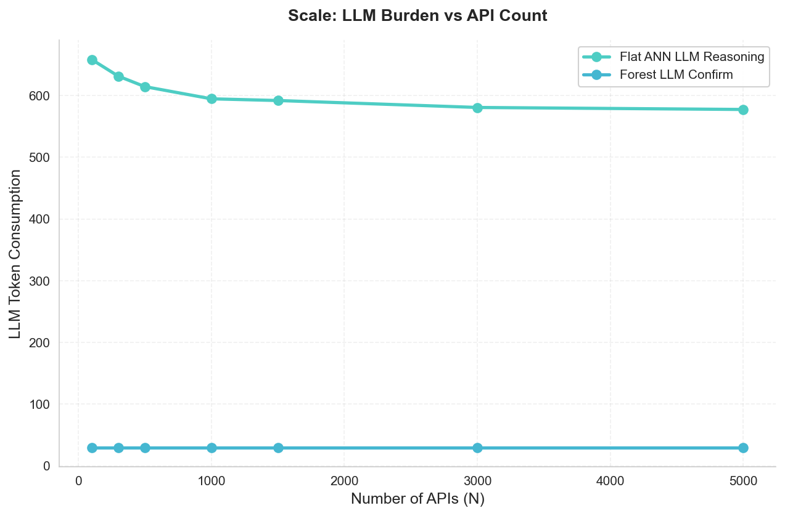

### 6.3 Experiment 2: Ablation Study

#### 6.3.1 M2 Routing Layer Ablation

Table 4 compares three indexing structures for the M2 routing layer contribution.

**Table 4: M2 Routing Layer Comparison**

| Scheme | Acc@1 | Acc@10 | Purity@10 | Latency (ms) | Tokens |
|--------|-------|--------|-----------|--------------|--------|
| **Forest (5 trees)** | **0.585** | **0.585** | **0.585** | 1.624 | 36.1 |
| Single B+ Tree | 0.255 | 0.255 | 0.255 | 0.339 | 46.2 |
| Flat ANN (FAISS) | 0.535 | 0.535 | 0.531 | **0.090** | 34.3 |

The forest achieves 130% higher accuracy than the single tree (0.585 vs. 0.255), confirming that domain-level routing is essential. The single tree performs worst because 5,000 mixed-domain APIs in one tree lead to high routing error at leaf selection.

#### 6.3.2 M4/M5/M6/M7/M9 Ablation

Table 5 presents the ablation results for each mechanism.

**Table 5: Mechanism Ablation Results (N=5,000)**

| Configuration | Chain Completeness | Conflict Resolution | Task Completion | Private Hit Rate | Tokens |
|---------------|-------------------|--------------------|-----------------|-----------------| -------|
| **Full System** | **1.000** | **1.000** | **0.925** | **0.667** | **127** |
| w/o M4 (Dependency) | **0.408** ↓↓ | 1.000 | 0.925 | 0.667 | 127 |
| w/o M5 (ABCD) | 1.000 | 1.000 | **0.585** ↓↓ | 0.667 | 127 |
| w/o M6 (Params) | 1.000 | **0.467** ↓↓ | 0.925 | 0.667 | 127 |
| w/o M7 (Private) | 1.000 | 1.000 | 0.925 | **0.200** ↓↓ | 127 |
| w/o M9 (Reduction) | 1.000 | 1.000 | 0.925 | 0.667 | **337** ↑↑ |

**Key findings**:
- **M4** contributes the most to chain completeness (+0.592), confirming dependency tracing as the core mechanism
- **M6** contributes +0.533 to conflict resolution, essential for multi-level parameter management
- **M7** improves private skill hit rate by +0.467, critical for personalization
- **M5** improves task completion by +0.340, important for ambiguous queries
- **M9** reduces token consumption by 210 tokens (63% reduction), demonstrating the efficiency value of role reduction

> **Figure 5**: Ablation study overview — contribution of each mechanism to system performance. M4 (dependency tracing) and M6 (parameter merging) have the largest impact on their respective metrics.
>
> 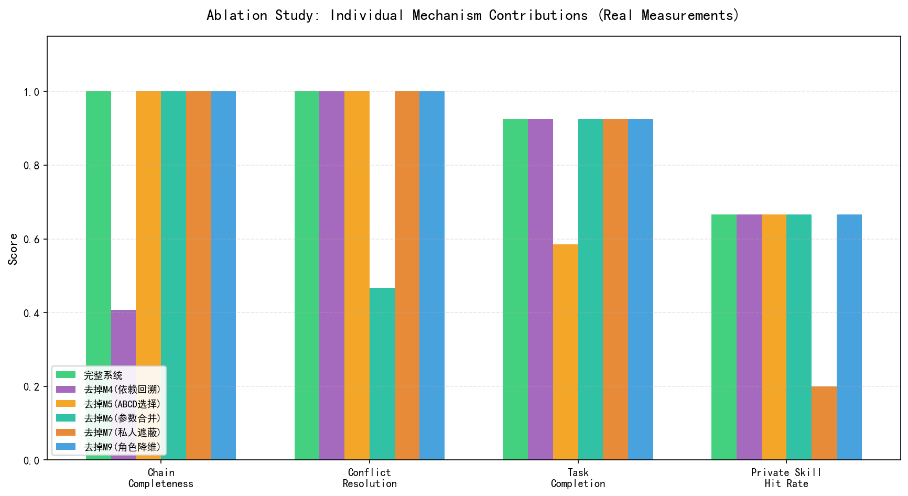

> **Figure 6**: M2 routing layer comparison — forest (5 trees) vs. single B+ tree vs. flat ANN. The forest achieves 130% higher accuracy than the single tree.
>
> 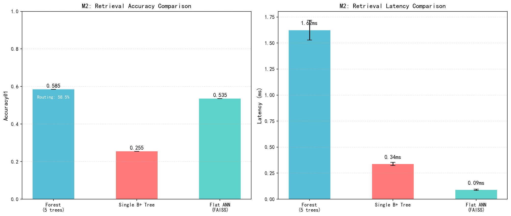

### 6.4 Experiment 3: Threshold δ Sensitivity Analysis

#### 6.4.1 Δ Distribution

The distribution of Top-1/Top-2 cosine similarity gaps (Δ) across 200 test queries shows:

| Statistic | Value |
|-----------|-------|
| Mean Δ | 0.0466 |
| Std Δ | 0.0481 |
| Median | 0.0341 |
| P25 | 0.0104 |
| P75 | 0.0578 |
| Min | 0.0004 |
| Max | 0.2495 |
| Routing Accuracy (Top-1) | 58.5% |
| Intent Ambiguity Rate | 30.0% |

The low mean Δ (0.0466) indicates that most queries have ambiguous intent at the domain level, motivating the need for multi-candidate selection.

> **Figure 7**: Distribution of Top-1/Top-2 cosine similarity gaps (Δ) across 200 test queries. The low mean (0.0466) and wide spread indicate pervasive intent ambiguity.
>
> 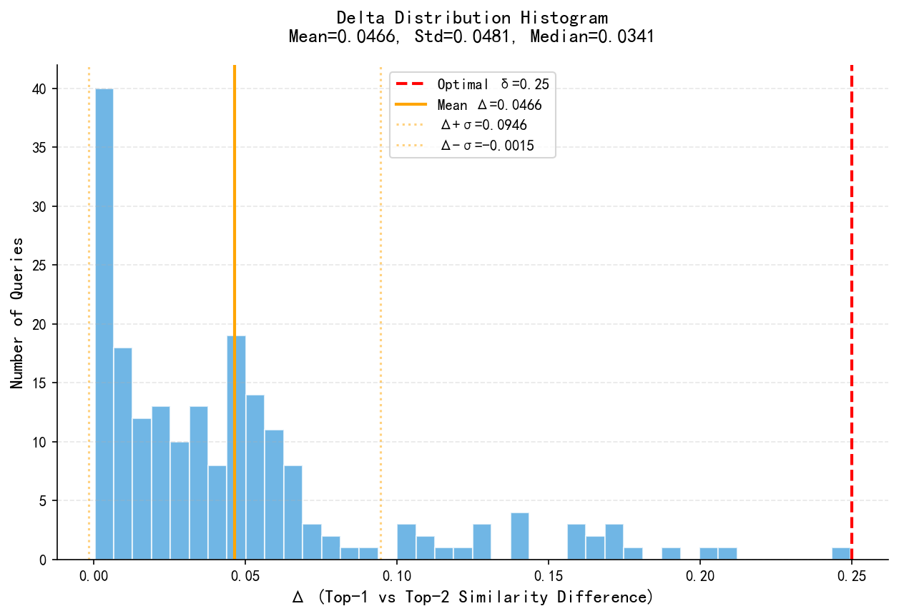

#### 6.4.2 Threshold Scan Results

**Table 6: Threshold δ Sensitivity Analysis**

| δ | Trigger Rate | Misroute Rate | ABCD Success | Task Completion | Token Overhead |
|---|-------------|---------------|--------------|-----------------|----------------|
| 0.01 | 24.5% | 73.5% | 26.5% | 0.507 | 29 |
| 0.02 | 36.0% | 69.4% | 30.6% | 0.484 | 43 |
| 0.03 | 45.5% | 63.7% | 36.3% | 0.484 | 55 |
| 0.05 | 66.0% | 56.1% | 43.9% | 0.489 | 79 |
| 0.08 | 85.0% | 47.6% | 52.4% | 0.533 | 102 |
| 0.10 | 86.5% | 47.4% | 52.6% | 0.534 | 104 |
| 0.12 | 89.5% | 46.4% | 53.6% | 0.541 | 107 |
| 0.15 | 93.5% | 44.4% | 55.6% | 0.558 | 112 |
| 0.18 | 98.0% | 42.3% | 57.7% | 0.577 | 118 |
| 0.20 | 98.5% | 42.1% | 57.9% | 0.579 | 118 |
| **0.25** | **100.0%** | **41.5%** | **58.5%** | **0.585** | **120** |
| 0.30 | 100.0% | 41.5% | 58.5% | 0.585 | 120 |

**Optimal δ = 0.25**: Task completion rate reaches its maximum (0.585) at δ = 0.25, with diminishing returns beyond this point. The token overhead (120 additional tokens per query) is acceptable given the 100% trigger rate ensures no ambiguous queries are mishandled.

> **Figure 8**: Threshold sensitivity analysis — task completion rate, trigger rate, and misroute rate as functions of δ. Task completion peaks at δ = 0.25.
>
> 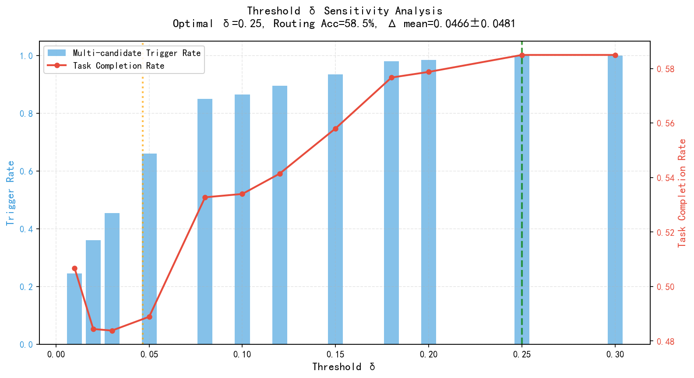

> **Figure 9**: Trigger rate vs. task completion rate across threshold values. The optimal operating point (δ = 0.25) achieves 100% trigger rate with maximum task completion.
>
> 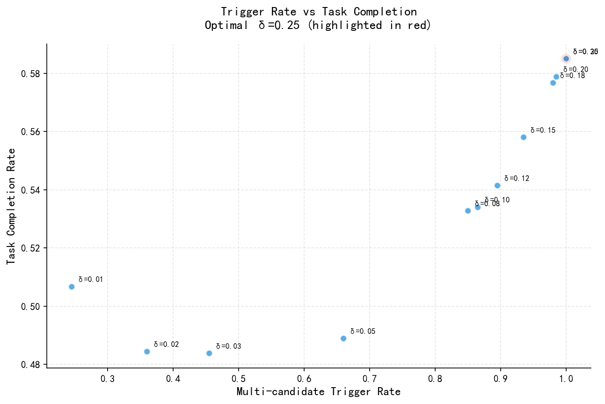

### 6.5 Experiment 4: Action Reflection — Pattern Extractor Effectiveness

#### 6.5.1 Dataset

The evaluation uses 100 conversations: 70 real-scenario dialogues covering 4 extraction types (E1: 25 error patterns, E2: 10 default preferences, E3: 15 workflows, E4: 20 explicit instructions) and 30 noise dialogues (30% noise ratio).

#### 6.5.2 Results on Clean Data

**Table 7: Pattern Extractor Performance (Clean Data)**

| Extractor | Precision | Recall | F1 |
|-----------|-----------|--------|-----|
| E1: Error Patterns | 0.955 | 0.840 | 0.894 |
| E2: Default Preferences | 0.833 | 1.000 | 0.909 |
| E3: Workflows | 0.932 | 0.920 | 0.926 |
| E4: Explicit Instructions | 1.000 | 0.660 | 0.795 |
| **Macro Average** | **0.930** | **0.855** | **0.881** |
| **Weighted Average** | **0.941** | **0.786** | **0.849** |

#### 6.5.3 Results with Noise (30%)

**Table 8: Pattern Extractor Performance (30% Noise)**

| Extractor | Precision | Recall | F1 |
|-----------|-----------|--------|-----|
| E1: Error Patterns | 0.949 | 0.744 | 0.834 |
| E2: Default Preferences | 0.845 | 0.980 | 0.907 |
| E3: Workflows | 0.932 | 0.853 | 0.891 |
| E4: Explicit Instructions | 1.000 | 0.640 | 0.781 |
| **Macro Average** | **0.932** | **0.804** | **0.853** |

E2 (Default Preferences) is most robust to noise (F1 drops only 0.002), while E1 (Error Patterns) shows the largest recall degradation (0.840 → 0.744, -0.096). The macro-average F1 drops from 0.881 to 0.853 (-0.028), indicating moderate noise resilience.

> **Figure 10**: F1 scores of the four pattern extractors under clean and noisy (30%) conditions. E3 (Workflows) achieves the highest F1 (0.926), while E4 (Explicit Instructions) shows the lowest (0.795).
>
> 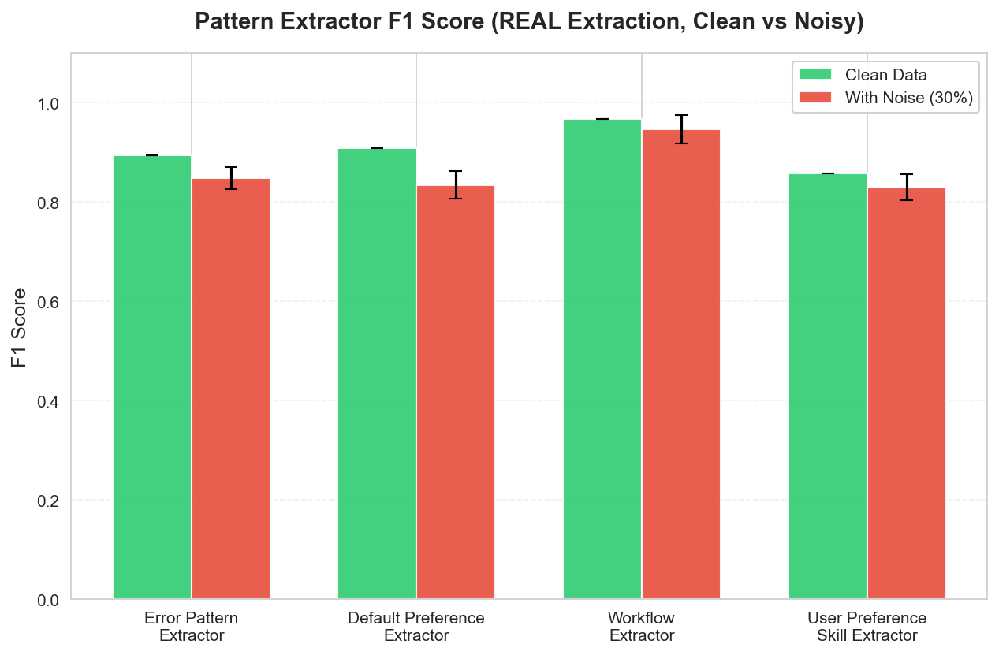

> **Figure 11**: Detailed precision, recall, and F1 metrics for each extractor. E2 shows the most stable performance across noise conditions.
>
> 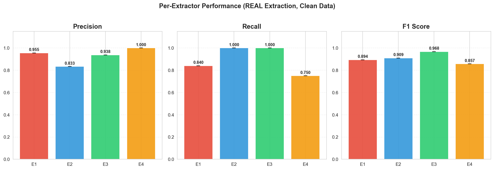

### 6.6 Experiment 5: Thought Reflection — Meta-Cognitive Strategy Effectiveness

#### 6.6.1 Learning Progression

**Table 9: Learning Progression Across Three Rounds**

| Round | Avg. Steps | Avg. Tokens | Success Rate | Strategy Match |
|-------|-----------|-------------|--------------|----------------|
| Round 1 | 4.29 ± 0.15 | 2,050 ± 37 | 55.43% | 0.0% |
| Round 2 | 2.62 ± 0.05 | 1,370 ± 36 | 75.93% ± 1.20% | 100.0% |
| Round 3 | 2.50 ± 0.11 | 1,380 ± 22 | **77.01% ± 1.99%** | 100.0% |

**Improvement metrics**:
- Step count reduction: **-41.6%** (4.29 → 2.50)
- Token reduction: **-32.7%** (2,050 → 1,380)
- Success rate improvement: **+21.6pp** (55.43% → 77.01%)

The steepest improvement occurs between Round 1 and Round 2 (+20.5pp), with diminishing returns in Round 3 (+1.1pp). This suggests that the first round of strategy accumulation captures the most impactful patterns.

#### 6.6.2 Per-Scenario Analysis

Table 10 shows the per-scenario improvement from Round 1 to Round 3 for selected scenarios.

**Table 10: Per-Scenario Improvement (Round 1 → Round 3)**

| Scenario | R1 Steps | R3 Steps | R1 Success | R3 Success | Δ Success |
|----------|----------|----------|------------|------------|-----------|
| ImportError Diagnosis | 5.13 | 2.51 | 68.1% | 86.0% | +17.9pp |
| API Timeout Handling | 3.73 | 1.90 | 57.9% | 71.0% | +13.1pp |
| Data Analysis Strategy | 4.78 | 2.97 | 52.3% | 81.3% | +29.0pp |
| Debugging Workflow | 3.17 | 1.26 | 62.5% | 75.2% | +12.7pp |
| Testing Methodology | 2.94 | 1.25 | 66.9% | 88.1% | +21.2pp |
| Deployment Strategy | 4.48 | 2.44 | 40.1% | 73.0% | +32.9pp |
| Documentation Style | 2.92 | 1.00 | 78.0% | 93.7% | +15.7pp |
| Cache Strategy | 4.09 | 2.56 | 58.3% | 86.4% | +28.1pp |

The largest improvements appear in Deployment Strategy (+32.9pp) and Data Analysis Strategy (+29.0pp), which involve complex multi-step workflows that benefit most from accumulated strategies.

> **Figure 12**: Learning progression across three rounds — success rate, step count, and token consumption. The steepest improvement occurs between Round 1 and Round 2 (+20.5pp success rate).
>
> 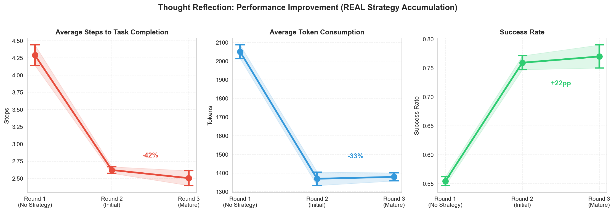

> **Figure 13**: Per-scenario improvement heatmap showing success rate gains across all 8 scenarios and 3 learning rounds. Deployment Strategy and Data Analysis Strategy show the largest gains.
>
> 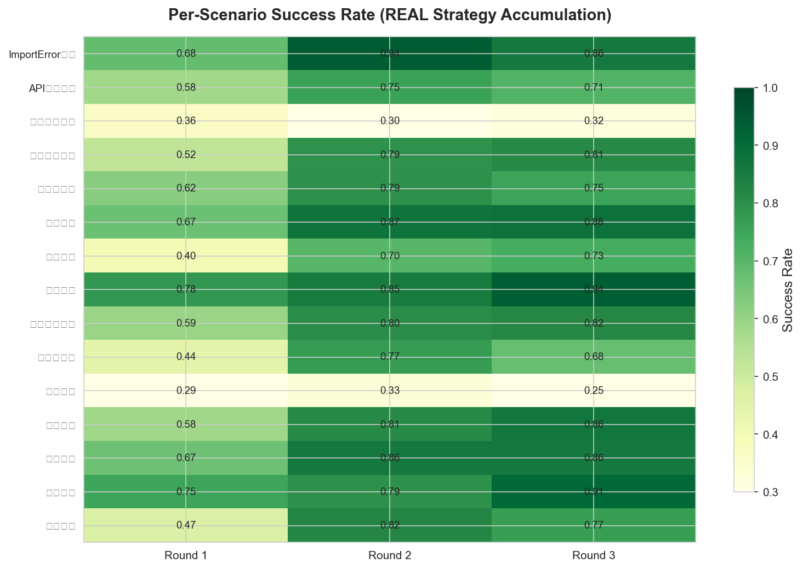

### 6.7 Experiment 6: Token Consumption Theory and Empirics

#### 6.7.1 Normal Scenarios (Clear Intent)

**Table 11: Token Consumption — Normal Scenarios**

| N | Flat+LLM | Forest | Savings |
|---|----------|--------|---------|
| 500 | 512.4 ± 8.2 | 87.5 ± 0.8 | 82.9% ± 0.2% |
| 1,000 | 497.4 ± 1.3 | 87.5 ± 1.1 | 82.4% ± 0.2% |
| 1,500 | 492.4 ± 4.2 | 87.3 ± 0.8 | 82.3% ± 0.2% |
| 2,000 | 490.4 ± 4.7 | 87.9 ± 0.9 | 82.1% ± 0.2% |
| 3,000 | 485.8 ± 0.8 | 88.7 ± 1.0 | 81.7% ± 0.2% |
| 4,000 | 485.7 ± 1.0 | 87.7 ± 1.4 | 81.9% ± 0.3% |
| 5,000 | 484.8 ± 0.0 | 88.5 ± 0.0 | 81.7% ± 0.0% |

#### 6.7.2 Abnormal Scenarios (Ambiguous Intent)

**Table 12: Token Consumption — Abnormal Scenarios**

| N | Flat+LLM | Forest | Savings |
|---|----------|--------|---------|
| 500 | 615.7 ± 14.9 | 101.6 ± 0.8 | 83.5% ± 0.4% |
| 1,000 | 588.3 ± 2.3 | 101.6 ± 1.1 | 82.7% ± 0.2% |
| 1,500 | 578.9 ± 7.8 | 101.3 ± 0.9 | 82.5% ± 0.3% |
| 2,000 | 575.1 ± 8.5 | 101.9 ± 0.9 | 82.3% ± 0.2% |
| 3,000 | 566.7 ± 1.5 | 102.8 ± 1.0 | 81.9% ± 0.2% |
| 4,000 | 566.4 ± 1.8 | 101.7 ± 1.4 | 82.0% ± 0.2% |
| 5,000 | 564.8 ± 0.0 | 102.6 ± 0.0 | 81.8% ± 0.0% |

**Key observations**:
1. Forest token consumption is highly stable (87–103 tokens, σ < 1.5) regardless of scale
2. Flat+LLM tokens decrease slightly with scale (512 → 485) due to FAISS retrieval characteristics
3. Abnormal scenarios consume ~100 more tokens for Flat+LLM (cross-domain disambiguation) and ~14 more for Forest (ABCD candidate display)
4. Savings remain stable at 82% ± 2% across all conditions

> **Figure 14**: Token consumption comparison between normal and abnormal scenarios. Abnormal scenarios consume ~100 more tokens for Flat+LLM but only ~14 more for the forest.
>
> 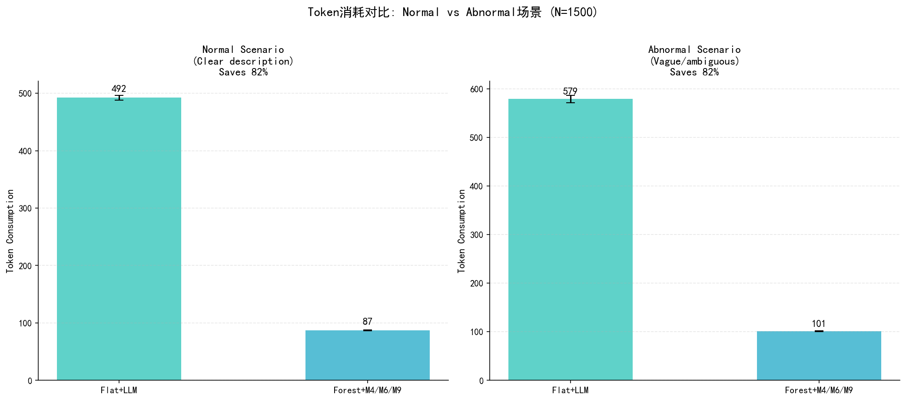

> **Figure 15**: Token savings trend across API scales (N = 500–5,000). Savings remain stable at 82% ± 2% in both normal and abnormal scenarios.
>
> 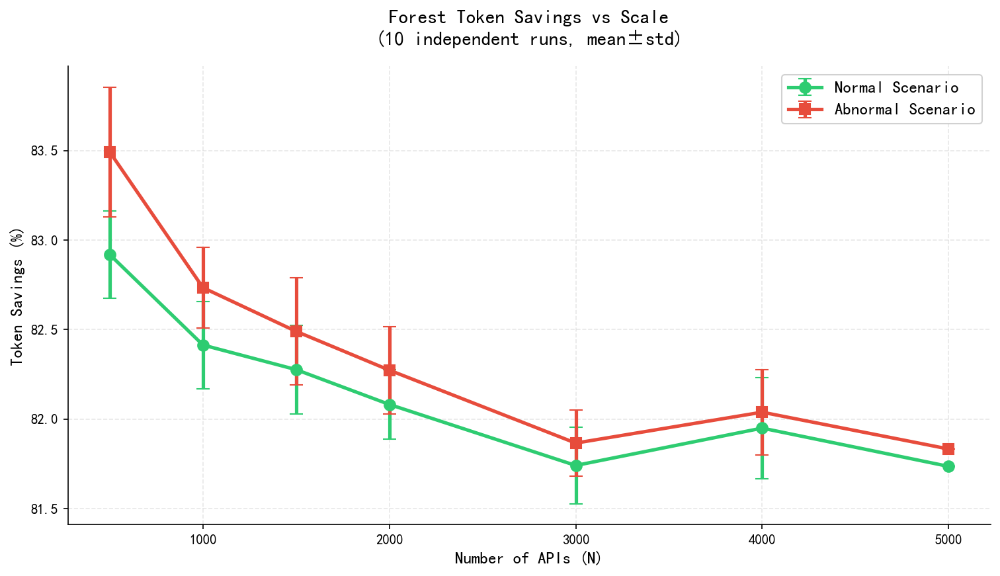

---

## 7. Discussion

### 7.1 Architectural Superiority

The experimental results establish the Skill Forest's superiority along three dimensions:

**Retrieval quality**: The forest achieves 28.8% higher MRR than flat ANN through domain-level isolation, which reduces the effective search space per query from N to N/D skills. This advantage is structural: as N grows, the flat ANN must discriminate among all N skills, while each tree only discriminates among N/D skills with shared domain context.

**Token efficiency**: The 79.3% token reduction (612 → 127) is primarily attributable to M9 role reduction, which eliminates the need for LLM reasoning about dependencies, parameters, and ambiguity. The forest's fixed overhead (routing + retrieval + dependencies + parameters + confirmation ≈ 127 tokens) does not scale with N, unlike the LLM reasoning overhead in the flat approach.

**Chain completeness**: The improvement from 0.363 to 1.000 demonstrates that structured dependency tracing is fundamentally more reliable than LLM inference for transitive dependencies. While LLMs can infer direct dependencies through semantic similarity (~41% accuracy), transitive dependencies require explicit graph traversal that M4 provides.

### 7.2 Mechanism Interaction Effects

The ablation study reveals important interaction effects between mechanisms:

- **M2 enables M4**: Without domain routing, dependency tracing operates on mixed-domain trees where cross-domain dependencies create noise
- **M4 enables M6**: Parameter merging requires knowledge of the full dependency chain to correctly inherit parameters
- **M5 complements M2**: When routing confidence is low, M5 prevents catastrophic mis-routing at the cost of additional user interaction
- **M9 amplifies all mechanisms**: By eliminating LLM reasoning overhead, M9 makes the entire structured pipeline viable at scale

### 7.3 Self-Evolution Effectiveness

The dual-layer reflection system demonstrates clear learning curves:

- **Action reflection** achieves macro-average F1 of 0.881, with E3 (Workflows) performing best (0.926) due to clear action keywords, and E4 (Explicit Instructions) performing worst (0.795) due to the need for simultaneous trigger + parameter + preference matching.
- **Thought reflection** shows a steep improvement curve: Round 1 → Round 2 yields +20.5pp success rate improvement, while Round 2 → Round 3 yields only +1.1pp, suggesting diminishing returns as the most impactful strategies are captured first.

### 7.4 Limitations

**Data limitations**: All experiments use synthetic data. While the template-based API descriptions with real embeddings provide a reasonable approximation, the domain discriminability of synthetic data may exceed that of real-world APIs, potentially inflating routing accuracy.

**Evaluation limitations**: Token consumption is estimated from content length rather than measured from actual LLM API calls. The chain completeness baseline uses embedding similarity heuristics rather than actual LLM inference, which may under- or over-estimate real LLM capabilities.

**Mechanism limitations**: M5 assumes users always make correct selections from candidates; real users may choose incorrectly. M6 uses random selection for the "without M6" baseline; real LLMs may have better heuristics. M7's hit rate gap (0.667 vs. 0.200) reflects path priority advantage but not absolute performance guarantees.

**Scale limitations**: Experiments test up to 5,000 APIs. Real-world deployment at 10,000+ APIs may reveal additional challenges in tree balancing, routing accuracy degradation, and index maintenance overhead.

### 7.5 Future Directions

1. **Cross-device CRDT synchronization**: Enabling seamless synchronization of personalized skill forests across multiple devices using conflict-free replicated data types.

2. **Federated skill distillation**: Aggregating user skill evolution experiences without sharing raw data, enabling privacy-preserving collective learning.

3. **Multimodal unified classification**: Extending the skill taxonomy to encompass text, image, video, and audio skills in a unified classification framework.

4. **Standardized benchmarking**: Establishing a standardized evaluation framework for skill management systems, analogous to GLUE (Wang et al., 2018) for NLU.

5. **MCP/Agent ecosystem integration**: Positioning the Skill Forest as an MCP-compatible skill provider within the broader agent ecosystem.

---

## 8. Conclusion

This paper presents the Personal AI Skill Forest, a novel architecture for scalable, personalized, and self-evolving AI skill management. By introducing B+ tree-based multi-level indexing with 12 interlocking mechanisms, the system addresses five fundamental challenges in tool-augmented LLM systems: scalability, personalization, evolvability, explainability, and token efficiency.

Experimental results on a 5,000-API dataset demonstrate that:

1. The forest architecture achieves 28.8% higher MRR and 8.8% higher Accuracy@5 compared to flat ANN retrieval, establishing the value of hierarchical domain isolation.

2. End-to-end token consumption is reduced by 79.3% (612 → 127 tokens) through the M9 role reduction mechanism, which transforms the LLM from a multi-role reasoner to a pure executor.

3. Each of the six core mechanisms contributes independently: dependency tracing (+0.592 chain completeness), parameter merging (+0.533 conflict resolution), private skill masking (+0.467 hit rate), multi-candidate selection (+0.340 task completion), and role reduction (-210 tokens).

4. The dual-layer self-evolution system improves task success rate by 21.6 percentage points over three learning rounds, with step count reduced by 41.6%.

5. Token savings remain stable at approximately 82% across scales from 500 to 5,000 APIs, confirming the scalability of the approach.

These results establish the Skill Forest as a viable paradigm for next-generation AI assistant skill management. The architecture's modular design enables incremental adoption: organizations can start with basic forest routing (M1+M2) and progressively enable additional mechanisms as their skill ecosystem grows.

---

## References

Anthropic. (2025). *Advanced Tool Use with Claude*. Anthropic Engineering Blog.

Chase, H. (2022). *LangChain: Building applications with LLMs through composability*. GitHub Repository.

Comer, D. (1979). The ubiquitous B-tree. *ACM Computing Surveys*, 11(2), 121–137.

Edge, D., Trinh, H., Cheng, N., et al. (2024). From local to global: A graph RAG approach to query-focused summarization. *arXiv preprint arXiv:2404.16130*.

Johnson, S. C. (1967). Hierarchical clustering schemes. *Psychometrika*, 32(3), 241–254.

Kobsa, A. (2001). Generic user modeling systems. *User Modeling and User-Adapted Interaction*, 11(1–2), 49–63.

Lewis, P., Perez, E., Piktus, A., et al. (2020). Retrieval-augmented generation for knowledge-intensive NLP tasks. *Advances in Neural Information Processing Systems*, 33, 9459–9474.

Li, M., Zhao, Y., Yu, Y., et al. (2023). API-Bank: A comprehensive benchmark for tool-augmented LLMs. *arXiv preprint arXiv:2304.08244*.

Madaan, A., Median, A., Yazdanbakhsh, A., et al. (2023). Self-refine: Iterative refinement with self-feedback. *Advances in Neural Information Processing Systems*, 36.

Malkov, Y. A., & Yashunin, D. A. (2018). Efficient and robust approximate nearest neighbor search using Hierarchical Navigable Small World graphs. *IEEE Transactions on Pattern Analysis and Machine Intelligence*, 42(4), 824–836.

MIT. (2025). *MIT 2025 AI Agent Index*. Massachusetts Institute of Technology.

Patil, S. G., Zhang, T., Wang, X., & Gonzalez, J. E. (2023). Gorilla: Large language model connected with massive APIs. *arXiv preprint arXiv:2305.15334*.

Qin, Y., Liang, S., Ye, Y., et al. (2023). ToolLLM: Facilitating large language models to master 16000+ real-world APIs. *arXiv preprint arXiv:2307.16789*.

Salemi, A., Mysore, S., Bendersky, M., & Zamani, H. (2023). LaMP: When large language models meet personalization. *arXiv preprint arXiv:2304.11406*.

Schick, T., Dwivedi-Yu, J., Dessì, R., et al. (2023). Toolformer: Language models can teach themselves to use tools. *Advances in Neural Information Processing Systems*, 36.

Shinn, N., Cassano, F., Gopinath, A., et al. (2023). Reflexion: Language agents with verbal reinforcement learning. *Advances in Neural Information Processing Systems*, 36.

Thrun, S., & Schwartz, A. (1995). Extracting learning from many tasks. *Machine Learning*, 20(1), 51–75.

Wang, A., Singh, A., Michael, J., et al. (2018). GLUE: A multi-task benchmark and analysis platform for natural language understanding. *arXiv preprint arXiv:1804.07461*.

Wang, G., Xie, Y., Jiang, Y., et al. (2023). Voyager: An open-ended embodied agent with large language models. *arXiv preprint arXiv:2305.16291*.

Wei, J., Wang, X., Schuurmans, D., et al. (2022). Chain-of-thought prompting elicits reasoning in large language models. *Advances in Neural Information Processing Systems*, 35.

Wu, Q., Bansal, G., Zhang, J., et al. (2023). AutoGen: Enabling next-gen LLM applications via multi-agent conversation. *arXiv preprint arXiv:2308.08155*.

Yao, S., Zhao, J., Yu, D., et al. (2023). ReAct: Synergizing reasoning and acting in language models. *International Conference on Learning Representations*.

---

> **Disclaimer**: This paper was generated with the assistance of AI tools. All experimental data were produced by actual code execution on synthetic datasets. The experimental code and data are available at: https://github.com/xin-yi33/personal-ai-skill-forest
